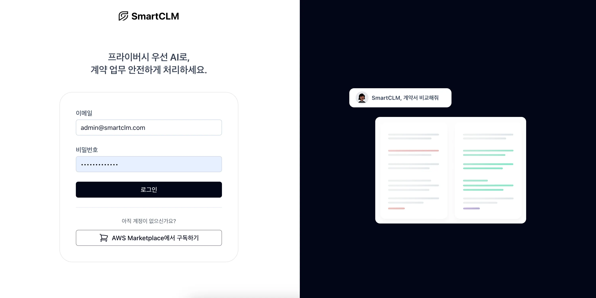
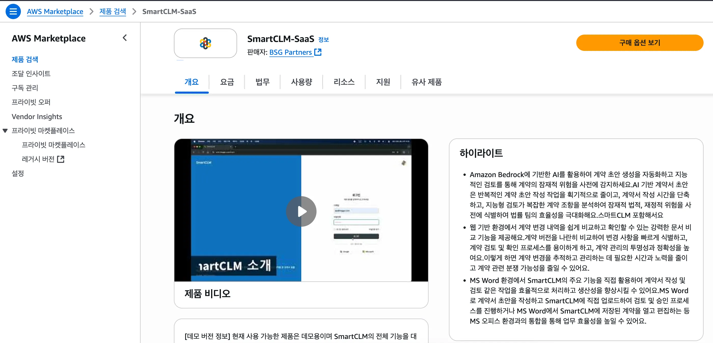
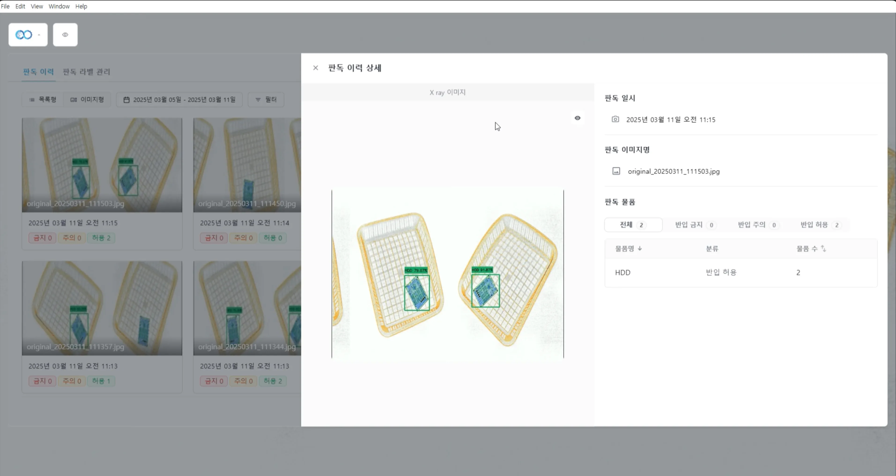
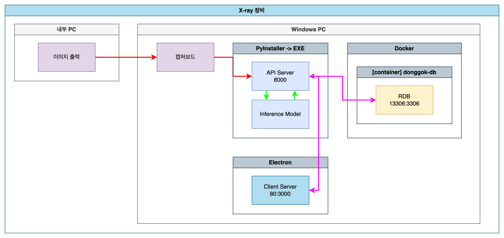
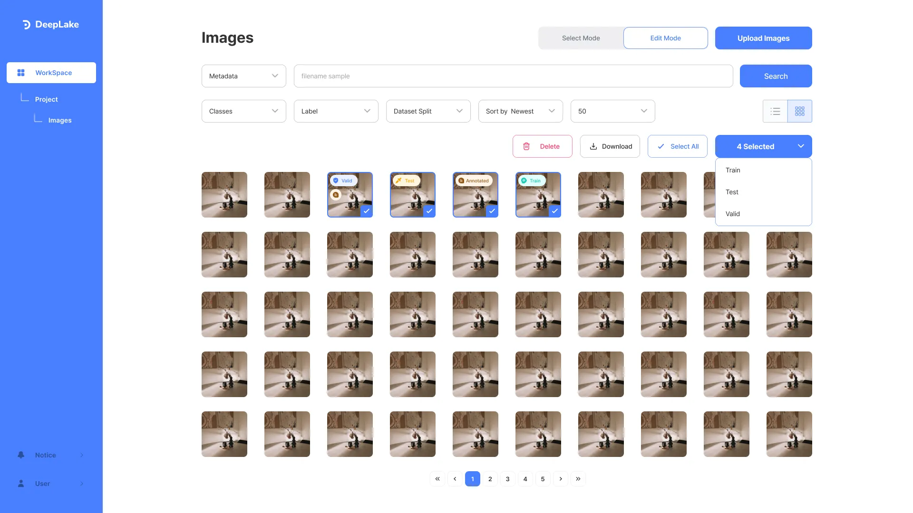
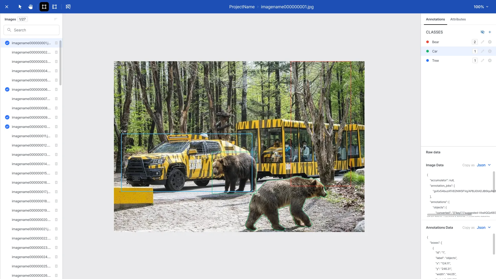
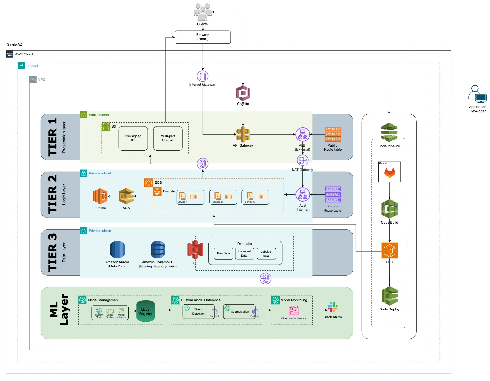
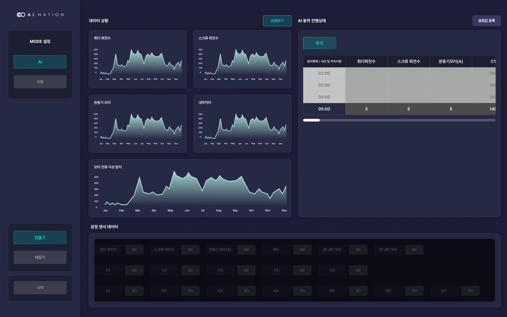
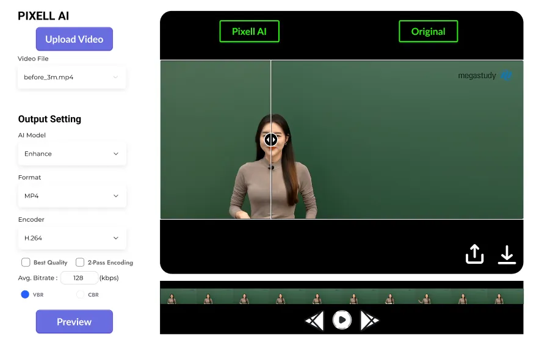
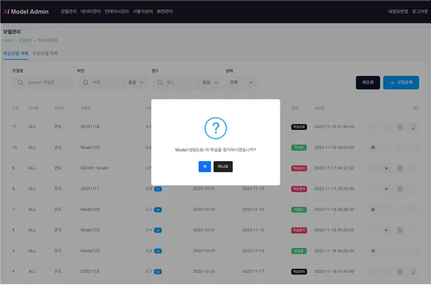

# 👋 장진원 | AI Backend Engineer

📄 **[포트폴리오 PDF 다운로드](./portfolio.pdf)**

## 📑 포트폴리오 목차

- [About Me](#about-me)
- [Tech Stack](#tech-stack)
  - [Backend](#backend)
  - [AI/Data](#aidata)
  - [Infra/DevOps](#infradevops)
  - [Tools](#tools)
- [Work Highlight](#work-highlight)
- [Projects](#projects)
  - [SmartCLM](#smartclm--rag-기반-agent-웹-서비스-구축)
  - [X-ray Detection 솔루션](#x-ray-detection-솔루션--실시간-영상-분석--웹-서비스-구축)
  - [딥레이크](#딥레이크--이미지-데이터셋-관리-기반-mlops-시스템-구축)
  - [스마트공장 솔루션 구축](#스마트공장-솔루션-구축--실시간-시계열-데이터-수집적재이상탐지-솔루션)
  - [PMS](#pms--딥러닝-기반-동영상-화질-개선-솔루션-구축)
  - [지하공동구 표준관리시스템 개발](#지하공동구-표준관리시스템-개발)
- [Development Principles](#development-principles)
- [Writing & Presentation](#writingpresentation)
- [ETC](#etc)
- [Education & Certificates](#educationcertificates)
- [Contact](#contact)

---

## About Me

빠른 문제 파악과 해결을 기반으로 안정적인 서비스를 지향하는 백엔드 개발자입니다.  
FastAPI 기반 서버 구축, 데이터 구조 설계, AI 모델 서빙 등 서버 개발 중심으로 경험을 쌓아왔습니다.

다양한 AI 프로젝트(자연어, 시계열, 비전, 영상)를 통해 모델 연계 및 데이터 처리 경험을 보유하고 있으며  
기획 → 데이터 분석 → 모델 구축 → 백엔드 개발까지 전 영역에 대한 이해를 갖추고 있습니다.

사업 제안부터 개발, 인증 테스트 대응까지 수행하며  
**End to End 서비스 구축 경험**을 쌓았습니다.

---

## Tech Stack

### Backend

- FastAPI, Flask, SQLAlchemy, SQLModel
- Redis, MariaDB, PostgreSQL, Kafka, TimescaleDB, InfluxDB
- JWT, OAuth2, RBAC 인증/권한
- Multi Processing / Threads, WebSocket, Asyncio, Celery

### AI/Data

- Pytorch, Scikit-learn
- YOLO series, LSTM/RNN/Transformer 기반 시계열 모델
- 데이터 파이프라인 구축 및 실시간 처리(Pandas, Numpy, Opencv, FFMPEG, KoNLPY)
- GPU, NPU 장치 환경 구축(cuda, Furiosa SDK)

### Infra/DevOps

- Docker, Nginx
- CI/CD 구축(Gitlab, Github, Jenkins, AWS 서비스)
- Server Architecture Design(On-premise, AWS)

### Tools

- Python env(Poetry, uv, venv)
- Observability(Grafana, Prometheus, Loki)
- Notion, Slack

---

## Work Highlight

실제 운영 환경에서 다음과 같은 핵심 기능을 구현했습니다.

- 고성능 데이터 수집 파이프라인 + 실시간 WebSocket 전송 구조 구축
- YOLO 기반 비전 모델 서빙 API 서버 독립 배포 (FastAPI)
- 딥러닝 모델 실시간 추론 → DB 저장 → 이벤트 감지 → WebSocket 브로드캐스트
- 대규모 이미지 데이터셋 관리 및 주기적 배치 처리
- 사용자/프로젝트/워크스페이스 권한 관리 및 인증 서버 구축
- GitHub Actions로 CI/CD 자동화

--

## Projects

프로젝트는 다음과 같은 구조로 작성되었습니다.

(프로젝트 개요 → 핵심 기여 → 기술 스택 → 성과/지표 → 개선/회고 )

---

### **SmartCLM** | RAG 기반 Agent 웹 서비스 구축

**기간:** 2025.07 ~ 2025.09

**역할:** AI Backend Engineer

**기술:** FastAPI, Langgraph, Langchain, Websocket, AWS RDS(PostgreSQL, PGVector), AWS ECS, AWS Bedrock, AWS CloudFormation

#### 📌 프로젝트 개요

- 계약 수명 주기 관리 시스템 구축
- 문서 업로드 RAG를 통해 법률 기반 계약서 비교, 위험조항 검토, 계약서 생성 기능 구현
- MS Word Add In / Web 기반 서비스 구축

#### ⭐ 핵심 기여

- FastAPI 기반 API, Chat Streaming 서버 개발
- 문서 업로드 → PDF 변환 → PDF Parsing → Chunking & Embedding → 데이터 적재(DB, AWS S3) 파이프라인 구축
- Prompt Engineering이 용이하도록 Langchain을 활용하여 RECL 구축
- Agent 성능 개선과 서비스 편의성을 위해 Langgraph를 활용하여 다중 Agent 및 기개발 API 기반 Tool을 활용하여 Agent 구축
- AWS Bedrock 다양한 LLM 연동
- Vue 기반 클라이언트 및 MS Office.js와 연동

#### 🏗 시스템 아키텍처

[Web] [MS Office] <-> [FastAPI Server] <-> [AWS Bedrock]

#### 🧰사용 기술

- Backend: FastAPI, SQLModel
- Infra: AWS ECS on Fargate, ALB, SQS, Lambda
- Data: AWS RDS(PostgreSQL, PGVector), ElastiCache(Redis)
- AI: AWS Bedrock(Claude Sonnet, Haiku), Langchain, Langgraph

#### 🎯 성과 & 결과

- 서비스 오픈(AWS Marketplace SaaS 등록 및 AI Industry Demo Showcase 참여)
- L사 법무팀 대상 CLM 고도화 프로젝트 PoC 수행 완료(정량/정성지표 통과)
- RAG 및 Prompt Engineering 기반 법무팀 요구사항 대응

#### 📝 Lessons Learned

- Cursor, Claude Code를 활용한 개발 적극 활용(Guide 문서 관리 및 메모리 관리 필수)
- AWS Marketplace SaaS 연동(entitlement, metering API 구현)
- RAG 파이프라인 구축(PDF Parser 별도 구축, 계층적 Chunking, 다양한 Embedding 모델 활용)
- Agent Tool 사용 시 보안 및 데이터 유출 방지를 위해 DB 직접 연결 지양(API tool 활용)
- Vector Store 성능 개선을 위한 서버 커스터마이징 개선 필요(또는 Milvus 같은 대안 도입 필요)
- Agent 성능 개선을 위해 복잡한 프롬프트 기반 Agent 보다 단순 프롬프트 기반 다중 Agent 활용

---

### **X-ray Detection 솔루션** | 실시간 영상 분석 + 웹 서비스 구축

**기간:** 2024.02 ~ 2025.05

**역할:** AI Backend Engineer

**기술:** FastAPI, WebSocket, Opencv, Pytorch, Redis, Docker, Nginx, Pyinstaller

#### 📌 프로젝트 개요

- 영상 캡처 보드에서 실시간 영상 데이터를 받아 웹 클라이언트로 표출하는 실시간 모니터링 시스템을 구축

#### ⭐ 핵심 기여

- FastAPI 기반 WebSocket 송신 서버 개발
- 영상 수신 → 인코딩 → 송출 파이프라인 구축
- 과거 영상 캡처 기능 및 열람 기능 개발
- 고객 요구사항에 맞는 통계 모니터링 기능 개발
- Object Detection DL 모델 Threshold, BBox 폰트 및 색상 실시간 연동 기능 개발
- Redis Pub/Sub 기반 상태 저장 및 배포 환경 구성
- React 기반 클라이언트와 연동 및 Desktop App 연동을 위해 Pyinstaller 패키징

#### 🏗 시스템 아키텍처

#### 🧰사용 기술

- Backend: FastAPI, SQLModel
- Infra: Docker, Nginx, PyInstaller
- Data: MariaDB, Redis
- AI: YOLO v11, Pytorch, OpenCV

#### 🎯 성과 & 결과

- 1초 지연 내 실시간 스트림 전송  
- 장애 발생 시 자동 재연결 및 클라이언트 복원
- 영상 처리 로직 분리로 서비스 안정성 향상
- I사 대상 납품 계약 검토

#### 📝 Lessons Learned

- 캡처보드 인식 및 원본 실시간 영상 제공 프로세스
- 딥러닝 모델 기반 추론 실시간 영상 제공 프로세스
- 웹 기반 환경보다 단일 서버 데스크탑 환경 구축(Desktop App)
- 지연 없는 실시간 영상 전송을 위한 Multiprocessing 개선 방안

---

### **딥레이크** | 이미지 데이터셋 관리 기반 MLOps 시스템 구축

**기간:** 2024.06 ~ 2025.05

**역할:** 개발 총괄 및 AI Backend Engineer

**기술:** FastAPI, Redis, Docker, AWS RDS(MySQL), AWS ECS, Cognito, Lambda, SQS, S3, DynamoDB, API Gateway, Sagemaker

#### 📌 프로젝트 개요

- 초대 및 권한 기능을 포함한 다중 워크스페이스/프로젝트 구조 이미지 저장 관리시스템을 구축

#### ⭐ 핵심 기여

- 초기 PoC 서비스 백엔드 단독 개발

  - 초대 토큰 발급/검증 API 구현
  - 프로젝트 멤버 & 워크스페이스 멤버 테이블 설계
  - 이미지 업로드 및 파일 관리 기능 개발
  - Redis 기반 Refresh Token 관리
  - 역할/권한 레벨 관리
  - React 기반 클라이언트와 연동

- Cloud 서비스 전환 개발 총괄

  - AWS 아키텍처 설계
  - API 명세서 작성 및 ERD 설계
  - 프로젝트 멤버 & 워크스페이스 멤버 관리 기능 개선
  - 초대 및 인증 기능 Cognito 전환
  - 이미지 대용량 업로드/다운로드 기능 개선(AWS S3, SQS, Lambda 활용)
  - 로깅 시스템 AWS CloudWatch 연동
  - React 기반 클라이언트와 연동

#### 🔧 핵심 기능

- 인증 및 검증

  - Google OAuth 인증
  - Email 기반 회원가입/로그인 및 멤버 초대
  - 초대 만료 및 재발급

- 프로젝트 및 워크스페이스

  - 결제 단위 워크스페이스 하위에 프로젝트 기반 이미지지 업로드 및 데이터 관리
  - 워크스페이스 관리(프로젝트, 멤버)
  - 프로젝트 내 이미지 대량 업로드 및 관리 기능
  - 이미지 라벨링(Annotation) 기능(BBox, Polygon)

#### 🏗 시스템 아키텍처

#### 🎯 성과 & 결과

- 권한 시스템 정비 및 클라우드 전환으로 운영 편의 증가
- 업로드 및 다운로드 API 응답 속도 35% 개선

#### 📝 Lessons Learned

- AWS 아키텍처 개발/운영 환경 구축
- AWS Sagemaker 활용 모델 구축
- COCO 데이터셋 활용한 이미지 딥러닝 모델 연계 인터페이스 설계
- 대용량 이미지 처리를 위한 메타데이터 처리를 NoSQL DB인 AWS DynamoDB 활용
- OAuth, FastAPI Dependency를 활용한 인증 및 권한 부여 관리기능 개발(RBAC)
- Restful API 설계 및 DDD/TDD 중심 API 기능 개발(테스트 코드 작성 -> Cursor 활용)
- AWS Marketplace SaaS 등록을 위한 기간 확보 필요(API 연계 및 제출 서류)

---

### **스마트공장 솔루션 구축** | 실시간 시계열 데이터 수집/적재/이상탐지 솔루션

**기간:** 2023.09 ~ 2024.05

**역할:** AI Backend Engineer / Infra Architecture

**기술:** FastAPI, Nginx, Redis, RabbitMQ, Docker, Jenkins, Harbor

#### 📌 프로젝트 개요

- 수요기업 대상 스마트 공장 구축을 위한 사전 기능 및 AI 기능 개발

#### ⭐ 핵심 기여

- 인프라 구축

  - On-premise 환경 Linux 서버 세팅
  - 개발서버 및 운영서버 CI/CD 구축(Gitlab, Jenkins, Harbor, Docker)
  - RabbitMQ 서버 구축
  - 웹서버 구축(FastAPI, Uvicorn, Gunicorn, Nginx)

- 백엔드 개발

  - Message Queue 기반 데이터 수집 기능 개발
  - MQ 관리 프로세스 운영을 위한 Multi Processing/Thread 기반의 Manager 기능 개발
  - WebSocket 기반 실시간 데이터 전송
  - 대시보드를 통한 기본적인 설비 컨트롤 기능 개발
  - React 기반 클라이언트와 연동

#### 🔧 핵심 기능

- 산업 현장 설비 센싱 데이터 실시간 수집 및 모니터링
- Batch 기반 일일 통계 데이터 제공
- 딥러닝 모델 기반 이상탐지 제공
- SQLAlchemy 복잡 쿼리 (JOIN, LIKE 검색, 페이징)
- Redis 캐싱으로 조회 속도 최적화
- FastAPI Router 기반 통계 API 분리

#### 🏗 시스템 아키텍처

#### 🎯 성과 & 결과

- 시스템 성과

  - 통계 조회 평균 응답 시간 120ms → 38ms  
  - 복잡한 데이터 쿼리를 구조화해 유지보수성 향상
  - On-premise 개발/운용 환경 CI/CD 무중단 배포를 통한 운영 개선

- 운용 성과

  - 공장 현장 담당자에게 실시간 센싱 데이터 모니터링 제공
  - 설비 이상 감지 데이터 제공을 통한 안정적 운용 관리 제공
  - 피크 전력 제어로 하루 최대 19,291,210원 절약
  - 물성 배합 관리 기반 산출물 품질 관리 제공
  - 전산 설비 제어 및 데이터 수집을 통한 최적 제어 솔루션 제공

#### 📝 Lessons Learned

---

### **PMS** | 딥러닝 기반 동영상 화질 개선 솔루션 구축

**기간:** 2023.06 ~ 2023.12

**역할:** 기획/설계 및 AI Backend Engineer

**기술:** FastAPI, Pytorch, OpenCV, FuriosaSDK, FFMPEG, Kafka, Zookeeper, Docker

#### 📌 프로젝트 개요

- 화질 개선 딥러닝 모델 기반의 Denoise 기능을 NPU 및 웹 기반 서버를 통해 수요기업에 솔루션 형태로 제공

#### ⭐ 핵심 기여

- 솔루션 기획 및 설계

  - 수요기업 요구사항 정의 및 화면 설계
  - 서비스 워크플로우 구축 및 시스템 구성(Docker, Spring Boot, Vue.js, FastAPI, Kafka)

- AI 모델 패키징

  - Pytorch 기반 모델 추론 코드를 FastAPI, Docker 컨테이너 구축
  - OpenCV, FFMPEG 기반 인코딩 기능 개발

- 모델 관리 기능 백엔드 개발

  - Docker SDK를 활용하여 기학습된 모델 컨테이너 등록/배포 기능 개발
  - Spring Boot 기반 서비스 API와 연계

- 인프라 구축

  - Gitlab CI/CD 구축
  - Kafka 서버 구축
  - Docker 컨테이너 기반 웹서버 구축
  - GPU 서버 세팅(NVIDIA)
  - NPU 서버 세팅(Furiosa Warboy)

#### 🔧 핵심 기능

- 동영상 업로드 및 다운로드 기능
- 업로드 영상을 대상 Denoise 적용 및 옵션에 따른 Encoding 제공
- 딥러닝 모델 컨테이너 등록 및 배포 기능
- 시스템 연동된 GPU/NPU 서버 현황 모니터링 제공 기능

#### 🏗 시스템 아키텍처

#### 🎯 성과 & 결과

- 시스템 성과

  - GPU/NPU 기반 모델 추론 환경 구축
  - 딥러닝 모델 관리 및 서빙 방안 제공

- 운용 성과

  - AI 반도체 분과 AI 바우처 사업 과제 완료
  - F사 대상 제품 납품

#### 📝 Lessons Learned

---

### **지하공동구 표준관리시스템 개발**

**기간** | 2022.08 ~ 2022.12

**기술** | FastAPI, Pytorch, Docker

#### 📌 프로젝트 개요

- 지하공동구 스마트 관리 목적
- 수집되는 센싱 데이터 등 다양한 기기에서 발생하는 빅데이터를 수집 및 관리하는 체계 시스템을 개발

#### ⭐ 핵심 기여

- 모델 관리 시스템 기획

  - 과제 요구사항 분석
  - 모델 관리 시스템 운용 워크플로우 및 프로세스 도식화
  - MLOps 방안 기획

- 딥러닝 모델 PL

  - 센서 데이터 기반 예측 모델 구축(Transformer 기반 N-HITS 모델)
  - 모델 연구원 측에 요구사항 및 데이터 전달
  - 최적 모델 선정을 위한 최신 연구 사례 공유 및 분석
  - TTL 인증을 위한 환경 세팅

- 모델 패키징 개발

  - Pytorch 기반 모델 학습/추론 코드를 FastAPI, Docker 컨테이너 구축

#### 🔧 핵심 기능

- 수집된 센싱 데이터 대상 및 기간을 설정하여 모델 학습
- 기간 설정을 통한 Batch 기반 자동 모델 학습 기능 제공
- 예측된 센싱 데이터를 기반으로 결로 예측 알람 모니터링 제공
- 전자정부프레임워크 기반 서비스 API와 연계하여 기능 제공

#### 🏗 시스템 아키텍처

#### 🎯 성과 & 결과

- 고양시 현장 설치 및 운용
- 지하공동구 표준관리시스템 개발 및 확산

#### 📝 Lessons Learned

---

## Development Principles

- 🚀 **읽기 쉬운 API**
  - 명확한 네이밍과 책임 분리
  - Restful, Open API 적용 가능하도록 규칙 적용
- 🧩 **단일 책임 원칙(SRP)**
  - 도메인 별 `router / service / crud / schema` 레이어 구분
  - 개발 기간 및 운영 인원에 따라 프로젝트 구성 변경 용이
- 🧪 **테스트 가능한 구조**
  - 비즈니스 로직을 service에 두고 테스트 용이
  - 최근 Cursor, Cluade Code를 활용한 테스트 코드 작성
- 📦 **CI/CD 자동화**
  - Pull Request → Build → Test → Deploy
  - On-premise, Cloud 환경 구축
- 📦 **AI tool 기반 개발**
  - Cursor, Claude Code와 같은 AI tool을 활용한 개발 적극 도입
  - 사전 Guide, 개발 Guide 문서를 작성 후 메모리를 고려하여 체계적 개발
  - 팀 인원에 맞는 개발 방법론 도입

---

## Writing/Presentation

- [2023, 고려대 안암캠퍼스] 심리학 기반 AI 이해와 활용 특강(AI 빅데이터 분석 프로세스)
- [2023, 한국공학대학교 탄소중립혁신센터] 스마트에너지플랫폼 MC기술세미나(제조현장 AI 특강)

- [2025, AWS 센터필드] AWS AI Industry Week Demo Showcase 참가(비에스지파트너스 서비스 설명)

---

## ETC

- [2022, NIPA 과제] 2022년도 5G 기반 디지털트윈 시설물 안전 실증사업(화재 시뮬레이션 PL - 차세대융합기술연구원과 협업)
- [2022, A사] 브랜드 모델 콘테스트 서비스 개발(화면설계 및 평가지표 수립 및 데이터 연계)
- [2021, 경기도경제과학진흥원] 지역경제 빅데이터 플랫폼(융합 데이터 생성 및 데이터 활용 서비스 기획)
- [2021, A사] K Beauty 빅데이터 트렌드 분석(통계 자료 작성 및 댓글 핵심 키워드 추출 분석)
- [2020, 서대문구청소년상담복지센터] 서대문청소년 위기실태조사(설문지 기반 통계자로 분석 및 보고서 작성)
- [2020, 중소기업벤처부 과제] 국내 최초 SDN/SDDC 기반 지능형 네트워크 관제 지원을 위한 플랫폼 기술 개발(네트워크 데이터 시계열 분석)
- [2019, KT 사업] 단국대학교 교육지식플랫폼(자연어 데이터를 분석하여 키워드 기반 연관성 수치 시스템 제공)

---

## Education/Certificates

- 경영학과 전공
- ADsP

---

## Contact

- ✉️ Email: <veroroot@gmail.com>
- 🔗 GitHub: <https://github.com/veroroot>
- 📄 Portpolio: <portfolio.pdf>
